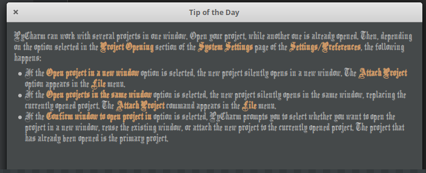
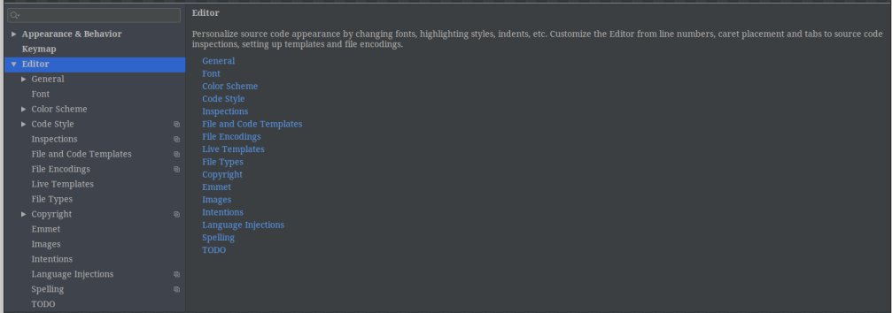

title: ubuntu下pycharm编辑器UI字体异常问题解决
date: 2019-07-31 00:19:17
tags: Linux 

​     先在这里声明一下，博主用的系统是ElementaryOS，个人觉得还是挺不错的一款LInux系统。下面就是正文了。

​     打开pycharm后，发现字体十分奇怪（不仅是这里的文字，还包括菜单栏上面的字体也是这种样式），如下图

​     一开始以为是因为下载的问题或者是系统的问题，然后百度了很久都没找到原因。最后一机灵，想了想是不是因为软件本身的设置问题，毕竟这些字体看起来也像是正常的字体而不是乱码。然后就去设置改变了pycharm这个软件本身的UI字体。下面是设置的步骤：

1、打开pycharm；

2、点击file-setting，打开设置面板：

3、选择Appearance & Behavior/Appearance

修改该选项的字体就可以修改软件UI字体的样式了（当然也可以设置大小）。